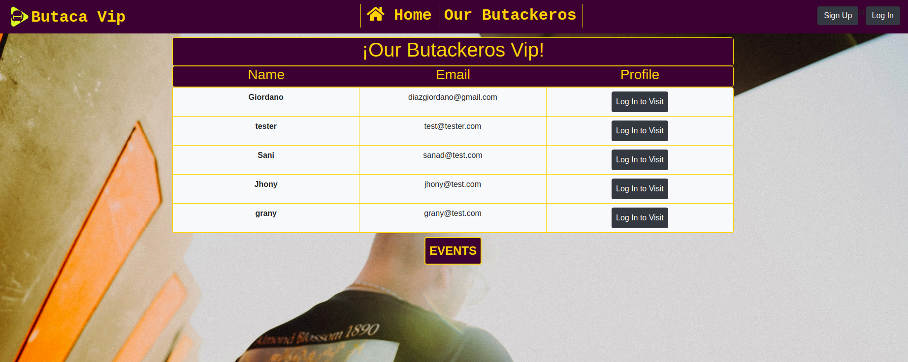
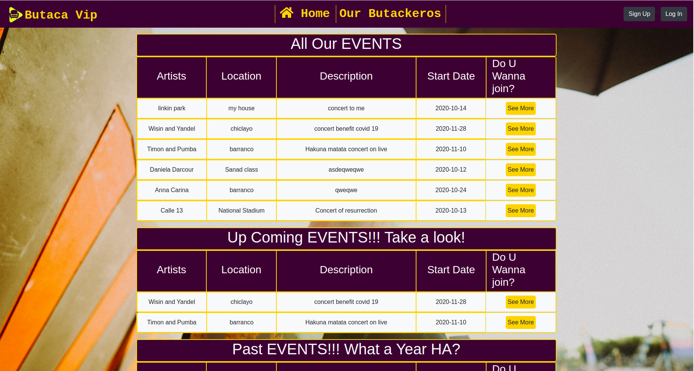
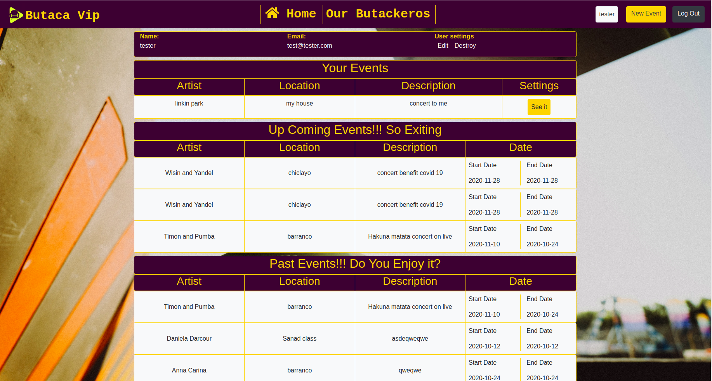

# 🧐 ButacaVip!! Private-Events project

## Concept

> Build a basic events app with rails to learn the basic concepts of users creating events, attending up coming events and seeing lastes events, and for the styles was used Bootstrap, It consist of making an associations web app, log in, log out, and alse they can create, edit and destory events.

> View without sign in your count



> View without sign in your count



> View with your user sign in



## 🛠 Built With

- Ruby on Rails
- Bootstrap
- Postgresql
- Linters


## 🔧 Getting Started

> To get a local copy up and running follow these simple example steps.

- Go to the main page of the repo.
- Press the "Code" button and get the repo link.
- Clone it using git clone.

### 📝 Prerequisites

- Ruby -v2.7.0p0
- Rails -v6.0.3.3

### 📝 Setup

 - Open a terminal
 - Copy this code : 
        ```
        git clone "put the link from github repo"
        ```
 - Run the program with this code :
        ```
        bundle install
        ```       
- Run the program with this code :
        ```
        rails db:create
        rails db:migrate
        ```
- now you can run ```rails server```
- Stop the program with: "Ctrl + C" (Windows or Linux) or "Command + C"(Apple)

### 📝 How to interact with the app?

- When the program is running go to your browser

- put: localhost:3000/

- Click on login, register and create a new article

- Enjoy the app.

### Usage

- Personal Project - Create a basic blog app just with learning purpose

## 👤 Authors

👤 **Giordano Díaz**

- Github: [@diazgio](https://github.com/diazgio)
- Twitter: [@giordano_diaz](https://twitter.com/giordano_diaz)
- LinkenIn:[LinkenIn](www.linkedin.com/in/Giordano-Diaz)

## 🤝 Contributing

Contributions, issues and feature requests are welcome!

Feel free to check the [issues page](issues/).

## Show your support

Give a ⭐️ if you like this project!

## Acknowledgments

- Hat tip to anyone whose code was used
- Inspiration
- etc

## 📝 License

This project is [MIT](LICENSE) licensed.
